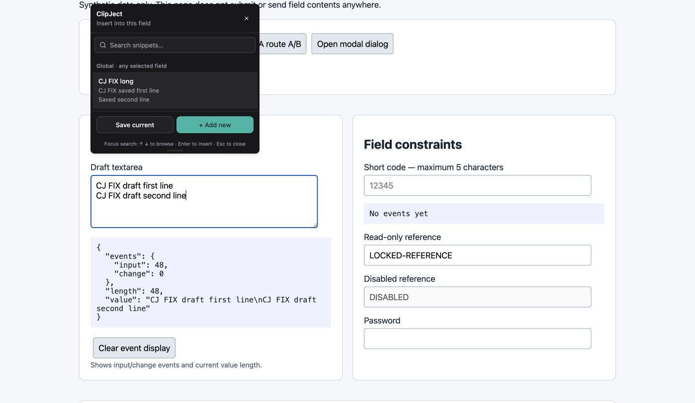

# Keep host-field Enter and arrow keys native

Pressing Enter while drafting in a selected textarea replaced the entire draft with a snippet. Picker navigation now handles Enter and arrows only while focus is inside the picker; the search hint explains where those shortcuts apply.

Branch: `codex/fix-picker-enter`. Code/test HEAD: `81bc54412d35b0c69bc0c8aa441e00c97bcd126e`.
Computer-verified build: `81bc54412d35b0c69bc0c8aa441e00c97bcd126e`.

Build, lint, and 37 source tests passed.

Computer verification:

- Typed two lines with Enter while the picker was open; both lines remained in the textarea.
- Used ArrowUp/Home and typed at the original caret position.
- Focused picker search, filtered a snippet, and inserted it with ArrowDown/Enter.

Host-field keyboard behavior and picker search navigation were checked separately.

