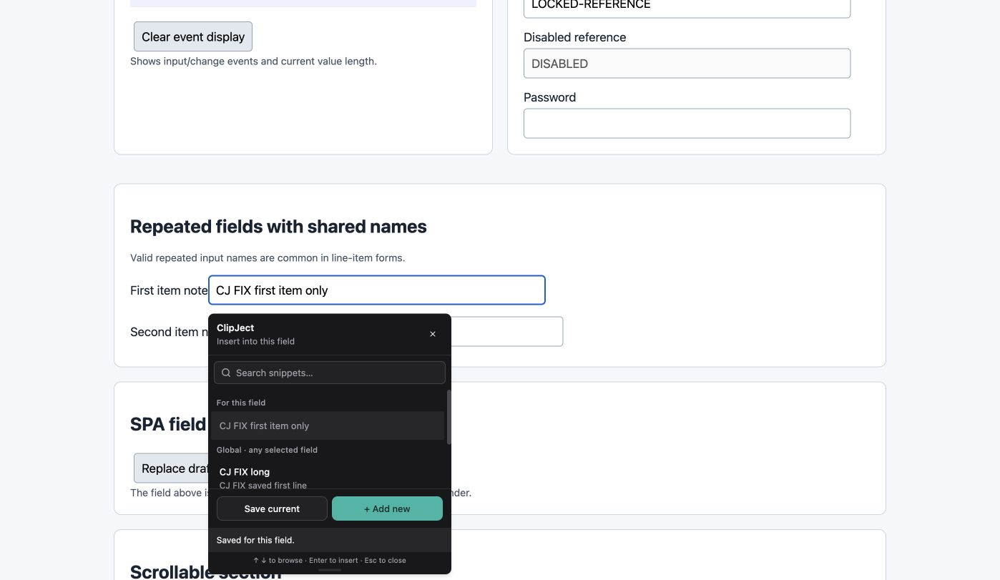
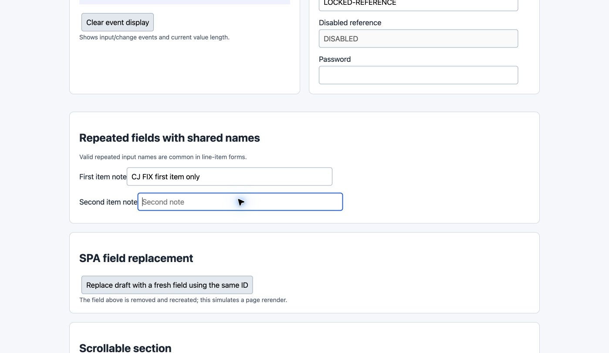
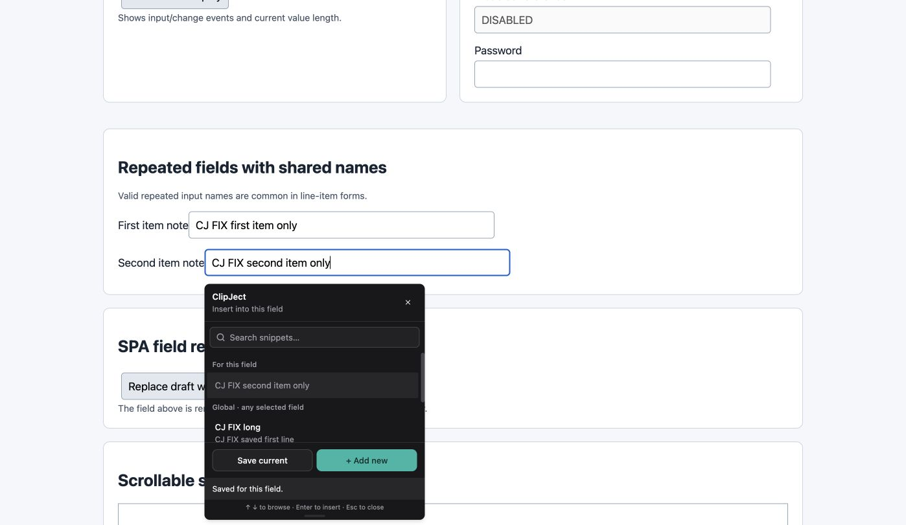
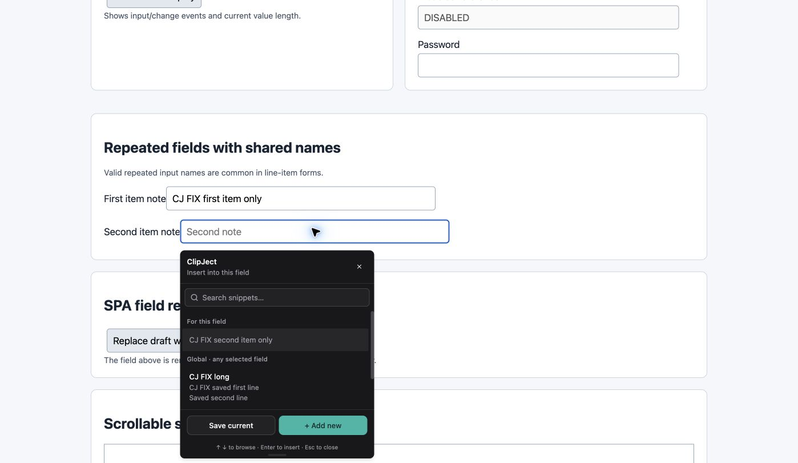

# Keep repeated fields independently scoped

Two inputs sharing a name inherited each other's selection and field snippets. Identity now chooses the first unique stable attribute and falls back to a DOM path when all candidate attributes are ambiguous. DOM changes that invalidate the active identity close stale pickers.

Branch: `codex/fix-field-identity`. Code/test HEAD: `b41eb401f951361943502a09df641278c0ac6fa8`.
Computer-verified build: `b41eb401f951361943502a09df641278c0ac6fa8`.

Build, lint, and 39 source tests passed.

Computer verification:

- Enrolled the first of two same-name fields and saved a field snippet.
- Focused the second field; it had no picker until separately enrolled.
- Saved a different snippet on the second field. Each picker showed only its own field snippet.
- Reloaded the page and confirmed isolation remained.

Unique legacy signatures remain compatible. Ambiguous legacy records are retained in the library rather than arbitrarily assigned. Uniqueness is evaluated against the current DOM; this does not introduce a persistent ambiguity quarantine.

