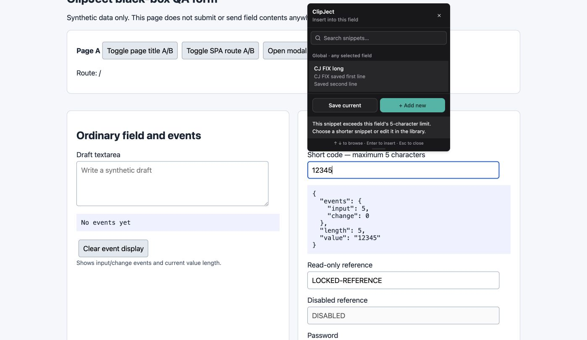
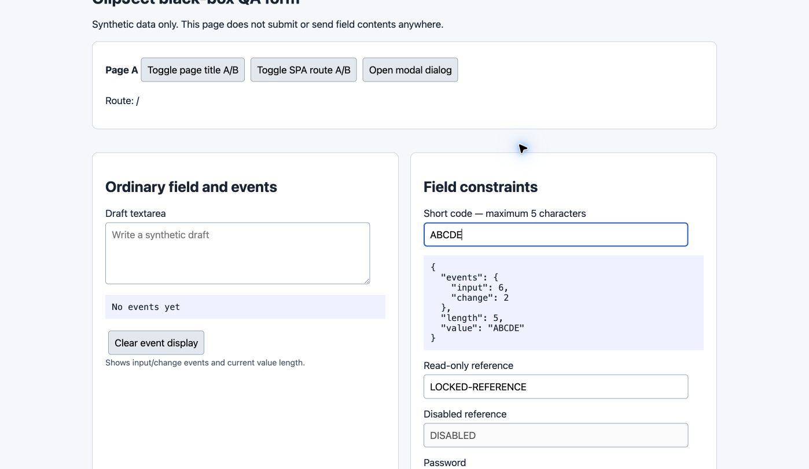

# Reject snippets that exceed a field maximum length

Snippet insertion bypassed maxlength. The insertion preflight now normalizes a candidate with the native field type, checks its UTF-16 length, and rejects oversize values with feedback. Rejection leaves the value and events unchanged instead of silently truncating.

Branch: `codex/fix-maxlength`. Code/test HEAD: `aa0341718168fdf3ae13593ebcbd226f72014923`.
Computer-verified build: `aa0341718168fdf3ae13593ebcbd226f72014923`.

Build, lint, and 51 source tests passed.

Computer verification:

- Typed into maxlength=5 and confirmed normal typing stopped at 12345.
- Clicked an oversized snippet; the value and event counters stayed unchanged and a five-character-limit error appeared.
- Inserted AB followed by a newline and CDE into the single-line input; native normalization produced ABCDE and insertion succeeded.

Source regressions cover zero/unset limits, emoji, newline and whitespace normalization, applicable input types, and limits changed while the picker is open.

