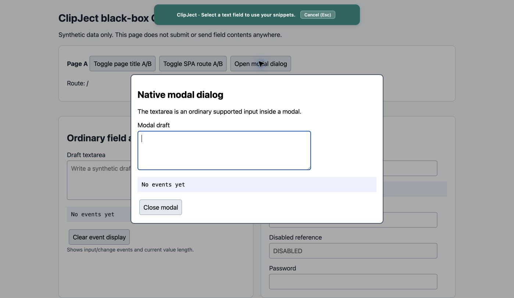
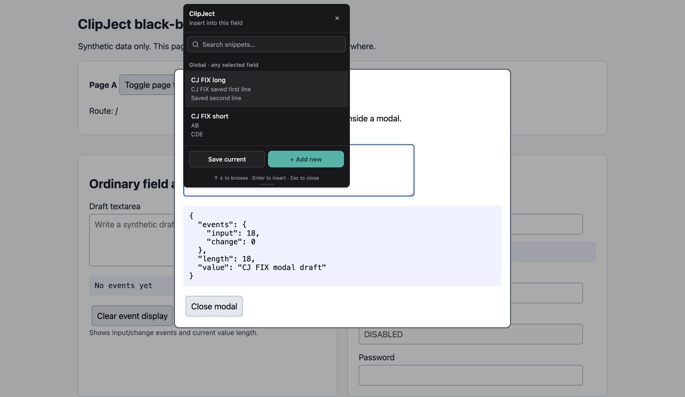
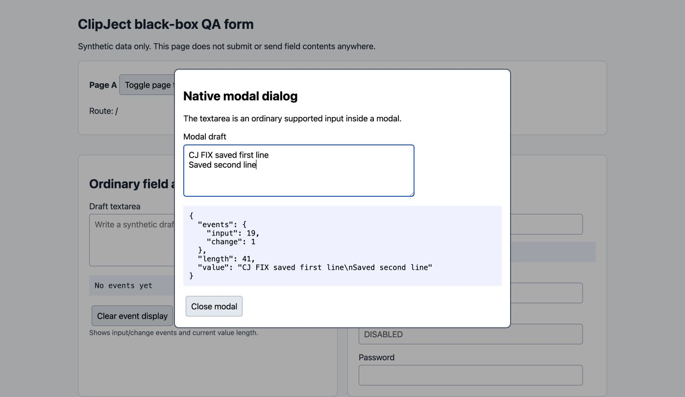
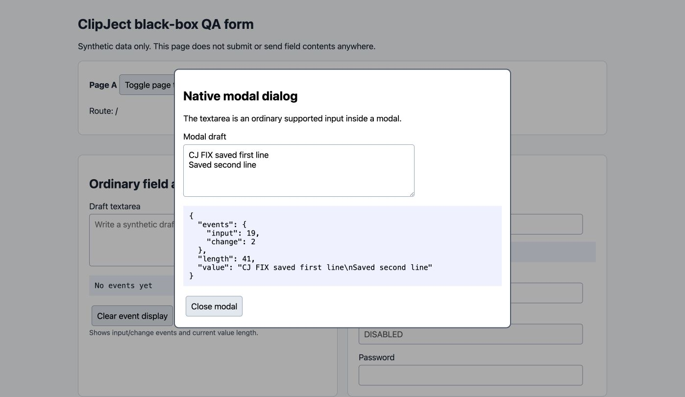
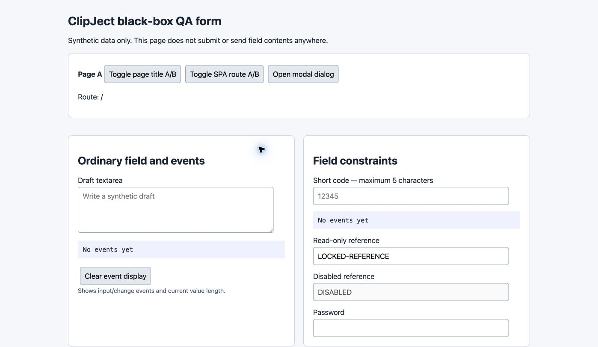

# Keep the snippet picker interactive inside native dialogs

For a textarea inside showModal(), the picker rendered behind the dialog and could not be clicked. The overlay now mounts with its target modal and uses the top layer, with cleanup when the dialog or target closes or disappears.

Branch: `codex/fix-modal-picker`. Code/test HEAD: `bc7cc5f6ead28ca38daea61661725d3e7f1c3e56`.
Computer-verified build: `bc7cc5f6ead28ca38daea61661725d3e7f1c3e56`.

Build, lint, and 28 source tests passed.

Computer verification:

- Enrolled a textarea inside a native modal using the visible selection banner.
- Clicked a snippet; the textarea value and input/change counters updated.
- Focused and used search, opened the Add new form, and canceled it.
- Pressed Escape; the picker closed while the modal remained open.
- Closed and reopened the dialog; the old picker was removed and the reopened picker worked.

The native browser harness also passes transform/overflow, hit-testing, focus, close/reopen, and removal cases.

