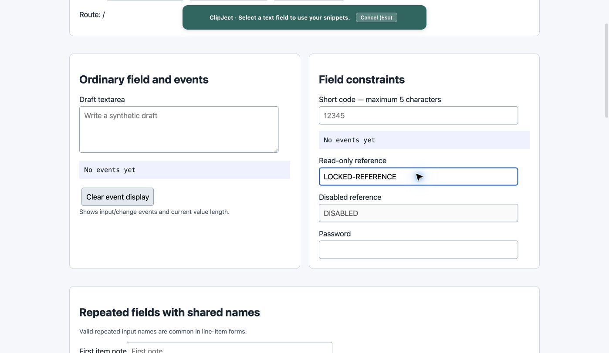
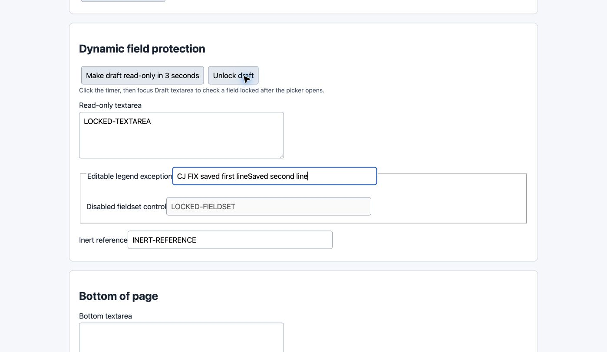
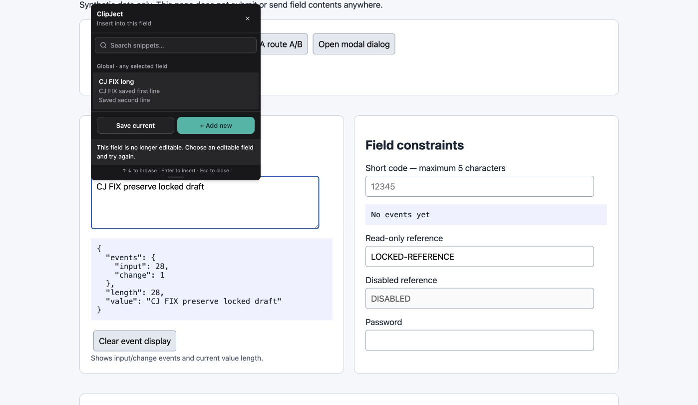

# Reject fields that are no longer editable

Read-only inputs could be enrolled and overwritten. Selection and insertion now reject read-only, disabled, inert, or detached targets, including fields locked after their picker opened. Insertion failures keep the picker open with feedback.

Branch: `codex/fix-readonly-fields`. Code/test HEAD: `0b79f26009d1061fb05fee9bb47cb18c711dd965`.
Computer-verified build: `0b79f26009d1061fb05fee9bb47cb18c711dd965`.

Build, lint, and 42 source tests passed.

Computer verification:

- Read-only input and textarea could not be enrolled.
- Disabled-fieldset and inert targets could not be enrolled.
- The editable first-legend input inside a disabled fieldset remained supported.
- Locked an enrolled textarea while its picker was open, then clicked a snippet; value and event counts stayed unchanged and feedback explained the rejection.

Chrome first-legend behavior was verified through the actual UI, in addition to source tests.

