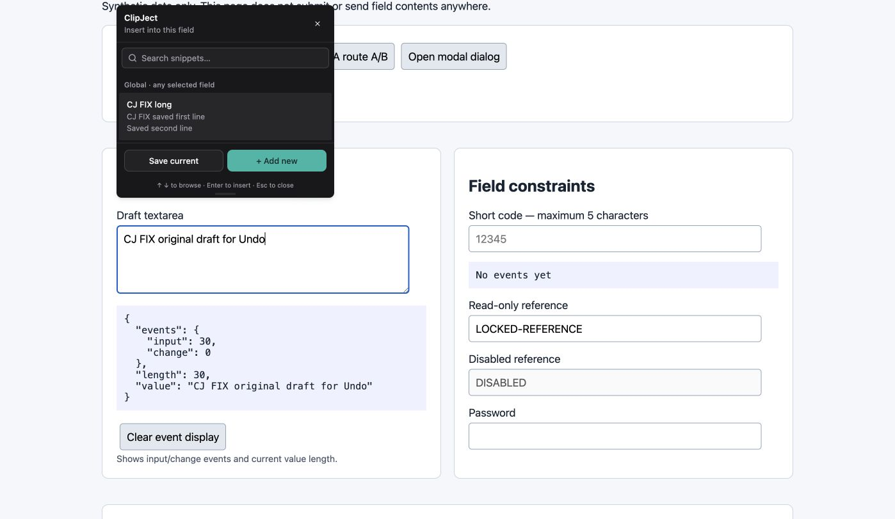
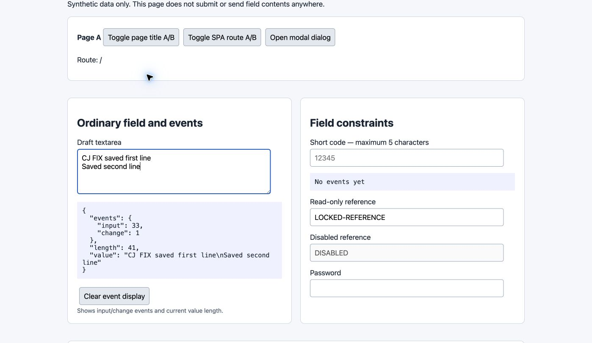
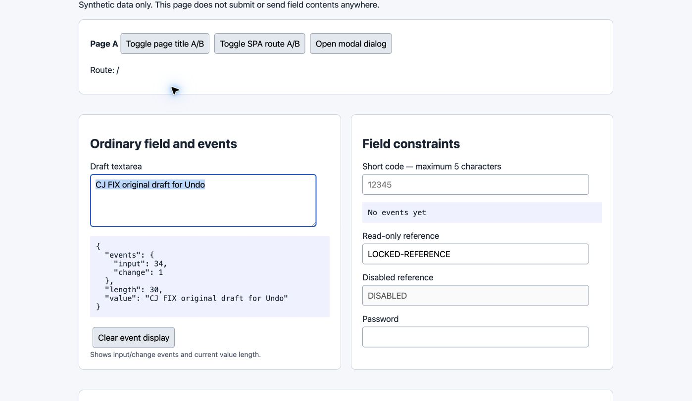
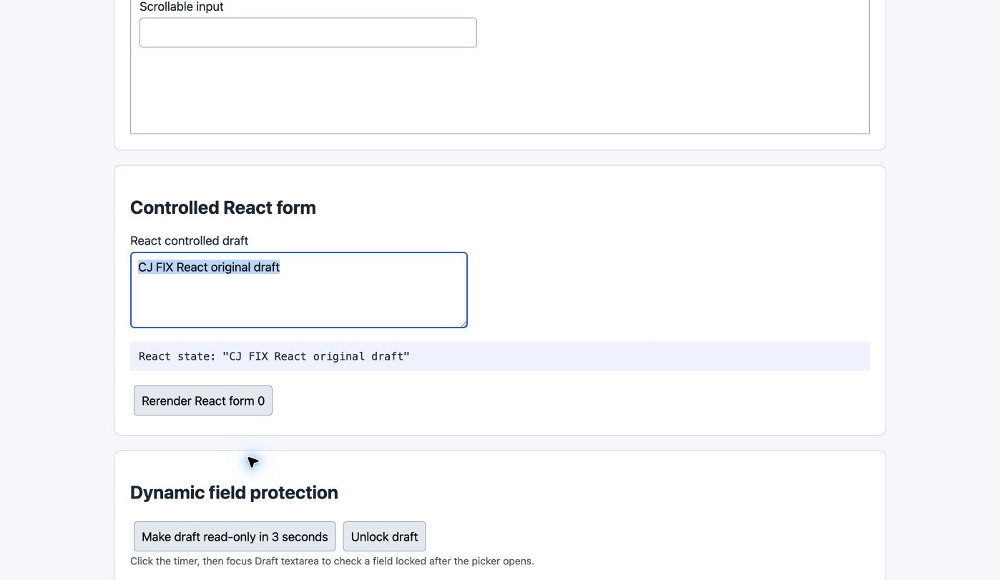
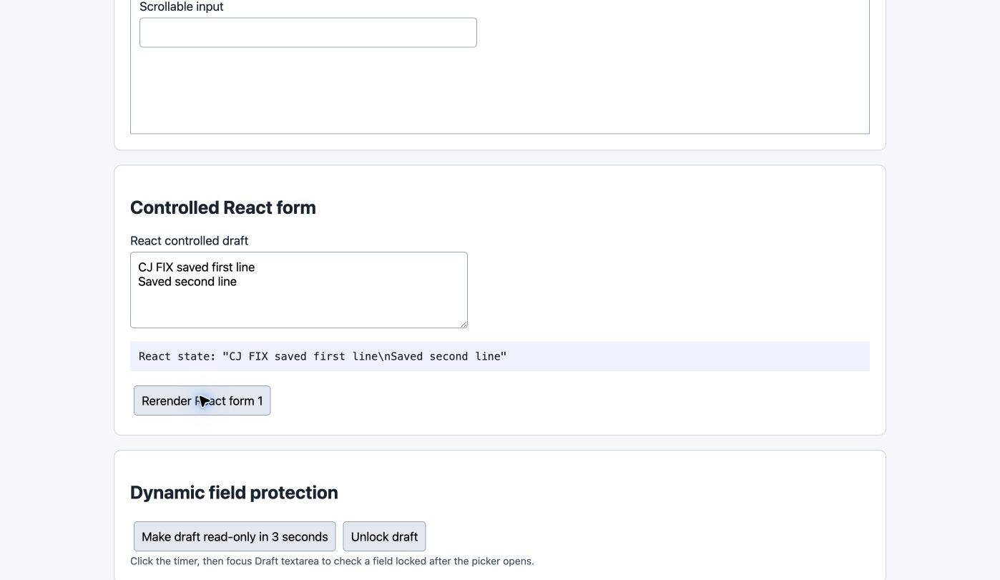

# Preserve native Undo and Redo for snippet insertion

Clicking a snippet previously discarded the draft outside the browser editing history. Insertion now uses the native editing command so one Undo restores the prior draft and Redo reapplies the snippet. Unsupported native insertions return an actionable error without a destructive setter fallback.

Branch: `codex/fix-native-undo`. Code/test HEAD: `e7db6cb6672e5d64bd632ef587f93315df6d9e7b`.
Computer-verified build: `bca2abba420d68a587cd8052f8b2773323f27f78`.

Build, lint, and 28 source tests passed.

Computer verification:

- Typed a draft, inserted a multiline snippet, pressed Cmd+Z, then Shift+Cmd+Z; the full draft and snippet were restored in turn.
- Repeated Undo/Redo in a React controlled textarea; visible React state tracked both edits.
- Triggered a React rerender after Redo; the inserted text persisted.

The native browser harness also passes. Native editing can emit multiple input events for multiline text. Fields that do not support this editing command show an error rather than losing Undo support.

The subsequent commit only updates the test harness to bundle imports. Its built extension assets are SHA-256 identical to the Computer-verified build.

